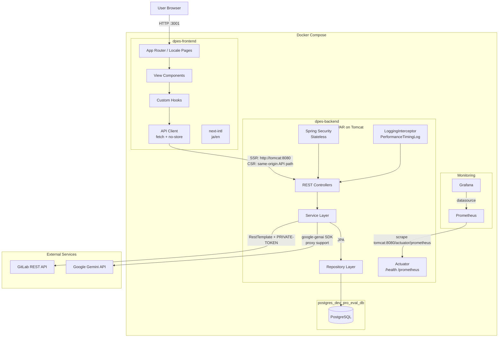
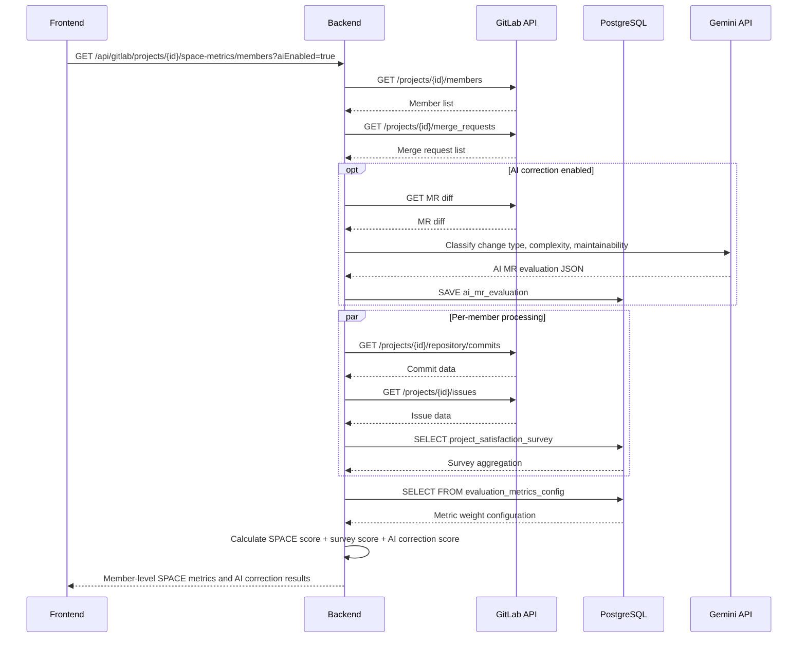

## 0. Project Overview

| Item | Details |
|---|---|
| Period | February 2026 - ongoing |
| Status | In progress / PoC validation |
| Development type | 0 to 1 product development |
| My scope | Backend, frontend, database design, CI/CD, PoC environment setup, AWS demo deployment, internal feedback collection |
| Main deliverables | GitLab API integration, SPACE metric calculation, dashboard UI, AI evaluation flow, Jenkins pipeline, Docker Compose deployment, password-protected AWS demo |
| Demo | [Password-protected AWS demo](https://dpes.lizheng.cc) using synthetic GitLab data |

This project is an internal PoC system for evaluating developer productivity from both quantitative and qualitative perspectives. It collects engineering activity data from GitLab, calculates productivity indicators based on the SPACE framework, visualizes the results, and uses Gemini API to generate qualitative evaluation and improvement suggestions.

The goal is not to reduce developer performance to a single activity count. Instead, the system tries to make productivity more explainable by combining activity, collaboration, efficiency, satisfaction, and AI-assisted code analysis.

For public demonstration, I deployed a password-protected version on AWS Lightsail with Docker Compose and Caddy. The public demo uses synthetic GitLab-style projects, developers, merge requests, and review data so that the product flow can be demonstrated without exposing internal company data.

## 0.1 Current Implementation Status

| Implemented | Under Validation | Improvement Candidates |
|---|---|---|
| Basic GitLab API data collection | User feedback organization | Redis cache |
| SPACE metric categories | Performance improvement | Reuse AI analysis results |
| Member-level and project-level score calculation | Evaluation accuracy | RAG-based knowledge retrieval |
| Dashboard visualization | Prompt improvement | Authentication |
| AI overall evaluation | System evaluation method | Async processing and job queue |
| Password-protected AWS demo | Real Gemini API call validation | IaC-based deployment |

This table intentionally includes both completed work and known improvement areas. The project is still being validated, so the important point is to show not only what was built, but also how the system is being improved through feedback and performance analysis.

## 1. Background

Many engineering organizations want to understand whether engineering productivity initiatives, including AI coding tools and process changes, are actually improving team performance. However, raw activity data such as commit count or merge request count is not enough. It can show activity volume, but it does not explain code complexity, collaboration quality, review friction, developer satisfaction, or improvement opportunities.

This PoC was created to answer three practical questions:

- How can engineering activity data be converted into understandable productivity indicators?
- How can managers and developers see productivity trends without relying only on subjective impressions?
- How can AI help explain the result and suggest concrete improvement actions?

## 2. Problem Statement

The system was designed to address the following issues:

- Internal engineering data such as GitLab issues, merge requests, commits, reviews, and survey results was not connected as productivity evidence.
- Activity volume alone could not fairly represent developer productivity or contribution quality.
- Developers needed clearer feedback on what to improve, not just a score.
- Managers needed a way to evaluate the effect of productivity improvement initiatives across projects or teams.
- AI-generated evaluation needed to be explainable enough to support discussion, not treated as a black box.

## 3. My Role

I was responsible for the core implementation and PoC delivery:

- Researched the feasibility of combining SPACE metrics with GitLab data and AI evaluation.
- Designed and implemented the backend services, REST APIs, data model, and metric calculation logic.
- Built the frontend dashboard with Next.js and TypeScript.
- Integrated GitLab REST API for member, merge request, commit, issue, and review-related data.
- Integrated Gemini API for AI-assisted merge request analysis and improvement suggestions.
- Designed the AI output format and mapped AI evaluation ranks to system-side scores.
- Built the Docker Compose based PoC environment.
- Set up the Jenkins pipeline for continuous deployment to the internal PoC environment.
- Collected feedback through internal demos, hands-on sessions, surveys, and regular reporting.

## 4. Goals

- Visualize developer and project productivity from multiple perspectives.
- Combine quantitative metrics with AI-assisted qualitative feedback.
- Provide a UI that managers and developers can understand without reading raw GitLab activity logs.
- Improve search, analysis, and response performance enough for PoC usage.
- Prepare the system for broader internal validation.

## 5. System Architecture



### PoC Deployment and Monitoring

```mermaid
graph LR
    DEV[Developer<br/>local changes] --> GIT[GitLab Repository]
    GIT -->|push / merge| JENKINS[Jenkins Pipeline]

    subgraph Pipeline["CI/CD Pipeline"]
        CHECKOUT[Checkout source]
        BUILD_FE[Build Frontend<br/>Next.js]
        BUILD_BE[Build Backend<br/>Spring Boot WAR]
        PACKAGE[Prepare deploy artifacts<br/>docker compose files / env]
        DEPLOY[Deploy to PoC server]
    end

    JENKINS --> CHECKOUT
    CHECKOUT --> BUILD_FE
    CHECKOUT --> BUILD_BE
    BUILD_FE --> PACKAGE
    BUILD_BE --> PACKAGE
    PACKAGE --> DEPLOY

    subgraph Server["Internal PoC Server"]
        subgraph ComposeRuntime["Docker Compose Runtime"]
            FE[dpes-frontend<br/>Next.js :3001]
            BE[dpes-backend<br/>Tomcat / Spring Boot :8080]
            DB[(PostgreSQL)]
            PROM[Prometheus]
            GRAF[Grafana]
        end
    end

    DEPLOY --> ComposeRuntime
    FE -->|API request| BE
    BE -->|JPA| DB
    BE -->|/actuator/health<br/>/actuator/prometheus| PROM
    PROM -->|datasource| GRAF
    BE -->|PerformanceTimingLog| LOGS[Application logs]
    GRAF --> DASH[Performance dashboard]
    LOGS --> INVESTIGATE[Latency / error investigation]
```



For the internal PoC environment, I avoided a fully manual deployment process and set up a Jenkins and Docker Compose based flow so that fixes and feature updates could be reflected more quickly. The backend exposes `/health` and `/prometheus` through Spring Boot Actuator and Micrometer. Prometheus collects the metrics, and Grafana is used to check processing time and system status.

For expensive operations such as GitLab API access, Gemini API calls, and metric aggregation, I also added `PerformanceTimingLog` so that bottlenecks can be investigated from application logs. This made it easier to identify candidates for caching, reducing repeated external API calls, and improving the calculation flow.

| Area | Implementation | Purpose |
|---|---|---|
| CI/CD | Jenkins pipeline for build and deployment | Reflect PoC changes into the validation environment quickly |
| Runtime | Docker Compose for frontend, backend, database, and monitoring services | Reduce environment differences and improve reproducibility |
| Health check | Spring Boot Actuator `/health` | Confirm backend startup status after deployment |
| Metrics | Micrometer + Prometheus | Collect response time, JVM, HTTP, and database-related metrics |
| Dashboard | Grafana | Visualize system status and processing performance |
| Logging | PerformanceTimingLog | Investigate bottlenecks in GitLab API, Gemini API, and aggregation processing |

## 6. Data Flow



## 7. Technology Stack

| Layer | Technology | Purpose |
|---|---|---|
| Backend | Spring Boot / Java | GitLab integration, metric calculation, REST API, Gemini API analysis |
| Frontend | Next.js / TypeScript | Dashboard UI, metric visualization, localized screens |
| Database | PostgreSQL | Metric configuration, survey data, AI evaluation results |
| DevOps | Jenkins | CI/CD pipeline |
| Container | Docker / Docker Compose | Standardized PoC runtime and deployment |
| Source data | GitLab | Issues, merge requests, commits, reviews, project members |
| Monitoring | Actuator / Prometheus / Grafana / Micrometer | Health check, metrics scraping, performance observation |

## 8. SPACE Framework Design

SPACE is useful because developer productivity should not be measured by a single metric. In this project, I used it as a structure for organizing multiple categories of evidence.

| Category | Example Metrics | Purpose |
|---|---|---|
| Satisfaction | Survey result | Estimate developer satisfaction and friction |
| Performance | Merged MRs, bug-related signals | Understand delivery and quality signals |
| Activity | Commits, MRs, comments | Show engineering activity volume |
| Communication | Review comments, MR discussions | Understand collaboration and review behavior |
| Efficiency | Lead time, review time | Identify bottlenecks in the development flow |

The metrics and weights are not treated as universal truth. They are configurable and should be adjusted based on the team, project type, and feedback from users.

## 9. AI Design

The AI component was designed to supplement quantitative metrics, not replace them. GitLab activity data can show what happened, but it cannot always explain whether a change was complex, risky, maintainable, or useful.

The system uses Gemini API for tasks such as:

- Classifying merge request changes.
- Estimating complexity, maintainability, and improvement areas.
- Generating qualitative evaluation text.
- Producing improvement suggestions for developers or teams.

To make AI output easier to control, I designed the result as structured JSON instead of free-form text. For scoring, I avoided using raw continuous values from the AI response. Instead, the AI evaluation is converted into discrete ranks such as High, Middle, and Low, and the system maps those ranks to score adjustments.

This design makes the output easier to validate, debug, and explain to users.

## 10. AI Evaluation and Guardrails

Because the system uses AI to support developer productivity analysis, I designed the AI output as a controlled assistant signal rather than a direct performance judgment. The purpose of the AI component is to explain possible improvement areas, not to replace quantitative metrics or human review.

### 10.1 Evaluation Criteria

The AI output should be evaluated from both technical and product perspectives.

| Evaluation Area | What I Check | Example |
|---|---|---|
| Format validity | Whether the response follows the expected JSON structure | The response can be parsed and stored without manual cleanup |
| Change classification | Whether the AI correctly identifies the type of merge request | Refactoring, bug fix, feature addition, test improvement |
| Reason quality | Whether the explanation is grounded in the MR diff | The reason refers to code structure, complexity, or test impact |
| Actionability | Whether the suggestion can be executed by a developer | Add regression tests, split a large MR, document API behavior |
| Consistency | Whether similar inputs produce similar evaluation ranks | Similar low-risk refactoring MRs should not receive very different ratings |
| Human agreement | Whether managers or developers consider the result useful | Feedback from demos, hands-on sessions, and surveys |

An expected AI response is designed to be structured, bounded, and explainable:

```json
{
  "changeType": "refactoring",
  "complexity": "middle",
  "maintainability": "high",
  "risk": "low",
  "reason": "The change reduces duplicated logic and does not affect public API behavior.",
  "suggestion": "Add regression tests for the affected service method."
}
```

This makes it possible to validate the output before using it in the UI or score calculation.

### 10.2 Guardrails

The main guardrail is that AI does not directly decide a developer's final productivity score. AI output is treated as a supplementary signal and is mapped into limited ranks such as High, Middle, and Low.

| Guardrail | Implementation Idea | Purpose |
|---|---|---|
| Structured output | Require Gemini API to return a predefined JSON schema | Avoid unstable free-form text |
| Bounded scoring | Map AI output to High / Middle / Low ranks | Prevent uncontrolled numeric scores |
| Fallback behavior | Use only quantitative SPACE metrics if AI fails | Keep the system usable during API errors |
| Sensitive data handling | Avoid sending tokens, personal information, and unnecessary internal details | Reduce privacy and security risk |
| Prompt constraints | Ask AI to evaluate the MR content, not the person's ability or personality | Keep feedback focused on technical evidence |
| Human review | Use feedback from managers and developers to validate usefulness | Avoid treating AI output as objective truth |
| Observability | Track latency, failures, JSON parse errors, and repeated API calls | Identify reliability and cost issues |
| Explainability | Require every rank to include a reason and suggestion | Make the result discussable |

The intended behavior is:

- If the AI response is valid, the system stores the structured result and shows it as supporting feedback.
- If the AI response is invalid, the system ignores the AI correction and keeps the quantitative SPACE result.
- If Gemini API is unavailable, the dashboard should still work with GitLab-based metrics.
- If users disagree with the AI suggestion, their feedback should be used to improve prompts, metric weights, or evaluation criteria.

### 10.3 Known Limitations

AI evaluation in this system still has limitations:

- There is no absolute ground truth for developer productivity.
- Prompt quality and metric weights need continuous tuning.
- AI suggestions can be useful but should not be used as personnel evaluation evidence without human review.
- More user feedback is needed to evaluate whether the suggestions are fair and actionable.
- A future RAG layer may be needed so AI suggestions can refer to internal coding standards, project rules, and previous feedback.

## 11. Key Engineering Challenges

### 11.1 Defining the SPACE Score

The most difficult part was not collecting data, but deciding how to convert multiple metrics into a meaningful score. There is no single correct formula for developer productivity. Metric selection, thresholds, weights, and AI correction logic all require careful design.

I handled this by separating metric configuration from calculation logic and treating the score as an explainable indicator rather than an absolute evaluation.

### 11.2 Backend Processing Time

After a user selects a project, developer, and period, the backend needs to fetch GitLab data, calculate metrics, request AI analysis, save AI evaluation results, and generate the final response. Running these operations synchronously caused long response times.

To analyze the bottleneck, I added backend monitoring with Actuator, Prometheus, Grafana, Micrometer, and performance timing logs. The next improvement candidates are caching AI results, reducing repeated API calls, improving the calculation flow, and introducing asynchronous processing.

### 11.3 AI Evaluation Quality

AI-generated productivity feedback does not have an objective ground truth. This makes evaluation difficult. The project therefore needs a feedback loop with real users, including managers and developers, to check whether the suggestions are useful and fair.

I treated prompt improvement, user feedback, and result explanation as part of the product design, not only as an implementation detail.

### 11.4 Deployment in an Internal PoC Environment

Fast iteration was important during the PoC. Manual deployment would have slowed down feedback collection, so I proposed and implemented a Jenkins and Docker Compose based deployment flow. This allowed the team to reflect fixes and new features into the PoC environment more consistently.

## 12. Results

The project is still in progress, but the PoC has already produced several concrete outcomes:

- Built a modern frontend with Next.js and TypeScript.
- Implemented GitLab API integration for engineering activity data.
- Implemented SPACE-based member and project productivity calculation.
- Added AI-assisted evaluation and improvement suggestion generation with Gemini API.
- Built dashboards to visualize productivity metrics and AI feedback.
- Set up Docker Compose based runtime and Jenkins based CI/CD deployment.
- Shared practical know-how about using generative AI in internal software development.
- Conducted internal validation and collected user feedback through demos, hands-on sessions, and surveys.

## 13. Remaining Improvements

- Add authentication before broader rollout.
- Add Redis or another cache layer to reduce repeated GitLab and Gemini API calls.
- Reuse stored AI analysis results instead of re-analyzing the same merge request diff.
- Improve the SPACE score calculation flow and reduce N+1 query patterns.
- Introduce asynchronous processing for expensive analysis tasks.
- Add RAG so AI suggestions can use internal project rules, coding standards, and previous feedback.
- Define a stronger evaluation process for AI output quality and usefulness.

## 14. Collaboration and Ownership

This project required more than implementation. I also worked on communication and adoption:

- Shared progress through twice-weekly group meetings and monthly manager reports.
- Ran hands-on sessions to explain how to use the system.
- Created surveys and collected user feedback from managers and developers.
- Reflected feedback into UI, metric explanation, and improvement candidates.
- Proposed CI/CD automation to reduce manual deployment work during PoC iteration.

The most important product lesson was that a productivity evaluation system must be transparent. If users cannot understand why a score or suggestion was produced, the system will not be trusted.

## 15. What I Learned

### Technical Lessons

- How to build a full-stack internal analytics application with Spring Boot, Next.js, PostgreSQL, Docker, and Jenkins.
- How to integrate Gemini API with structured output and prompt design.
- How to combine quantitative metrics with AI-assisted qualitative evaluation.
- How to use Actuator, Prometheus, Grafana, and logging to identify backend bottlenecks.

### Product Lessons

- Developer productivity should be treated as a multi-dimensional signal, not a single ranking.
- AI feedback needs explanation, constraints, and user feedback to become useful.
- Managers and developers need different views of the same data.
- A PoC system should make assumptions visible so they can be challenged and improved.

## 16. Interview Pitch

### Short Version

I built a PoC developer productivity evaluation system that collects GitLab issues, merge requests, commits, and review data, calculates SPACE-based productivity indicators, and uses Gemini API to generate qualitative evaluation and improvement suggestions. I was responsible for the backend, frontend, metric calculation, AI evaluation flow, Docker Compose environment, and Jenkins deployment pipeline.

### Detailed Version

This project was created to evaluate developer productivity from multiple perspectives instead of relying only on activity count. The backend integrates with GitLab API to collect engineering activity data and calculates member-level and project-level metrics based on the SPACE framework. I also integrated survey data and Gemini API analysis to supplement quantitative metrics with qualitative feedback.

On the frontend, I used Next.js and TypeScript to build dashboards that show productivity indicators and AI-generated improvement suggestions. On the backend, I implemented Spring Boot services for GitLab integration, metric calculation, AI evaluation, data persistence, and monitoring. I also built the Docker Compose runtime and Jenkins pipeline so the PoC environment could be updated continuously.

The hardest part was designing a fair and explainable score. There is no objective formula for developer productivity, so I designed the system to separate metric configuration from calculation logic and used AI output as structured ranks rather than uncontrolled numerical scores. I also collected feedback through internal demos, hands-on sessions, and surveys so the system could be improved based on real user reactions.

This project gave me practical experience in building an AI-enabled internal platform that combines backend engineering, data analysis, AI integration, monitoring, deployment, and stakeholder communication.
