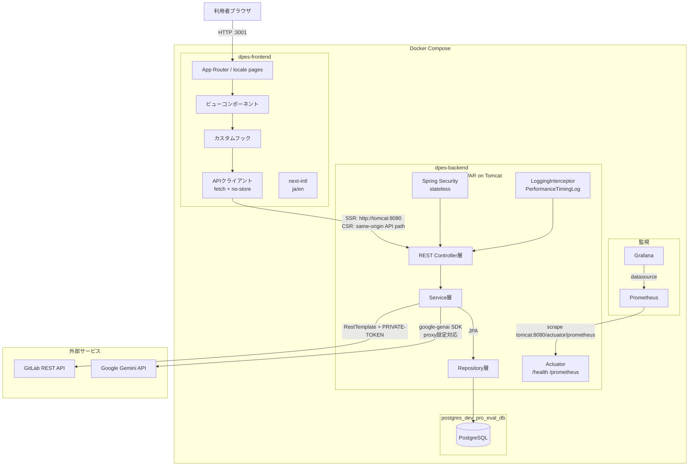
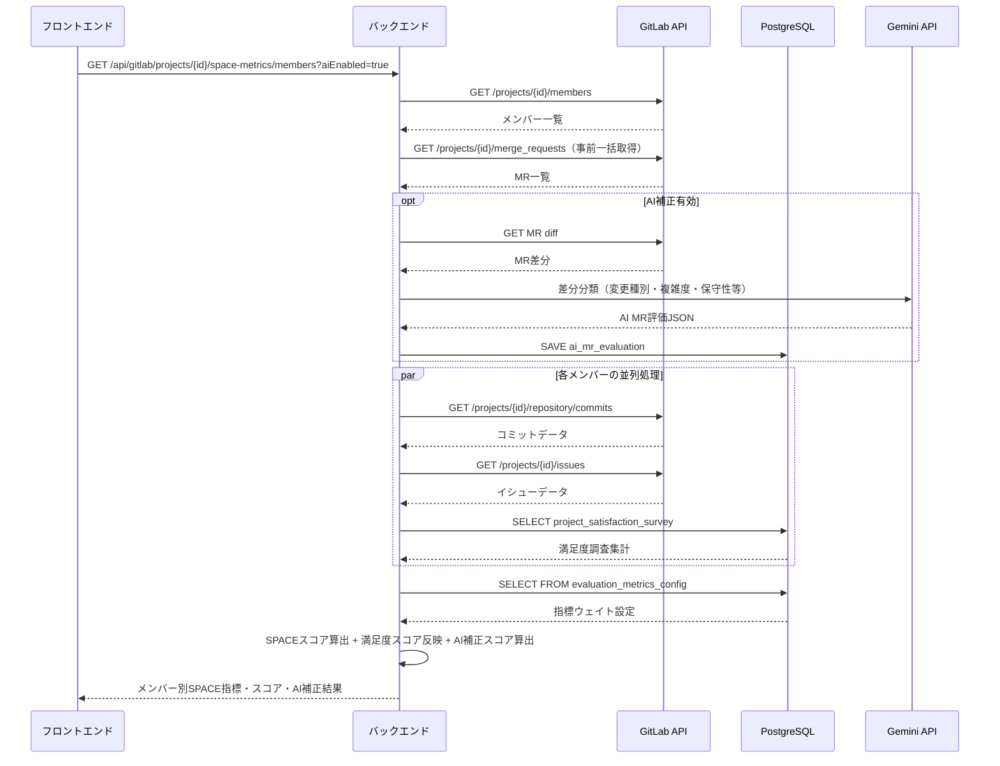

## 0. プロジェクト基本情報

| 項目 | 内容 |
|---|---|
| 期間 | 2026年2月 - 継続中 |
| ステータス | 進行中 / PoC 検証中 |
| 開発タイプ | 0 → 1 の新規開発 |
| 担当範囲 | バックエンド、フロントエンド、CI/CD、PoC 環境構築、部内Feedback収集 |
| 主な成果物 | GitLab API 連携、SPACE 指標計算、可視化画面、Jenkins pipeline、Docker Compose 構成 |

## 0.1 実装状況と改善候補

| Implemented / 実装済み | In Progress / 検証中 | Next Improvements / 改善候補 |
|---|---|---|
| GitLab API からデータを取得する基本処理 | Feedback整理 | Redis追加 |
| SPACE フレームワークに基づく指標カテゴリの整理 | システムパフォーマンス改善 | AI分析結果再利用 |
| メンバー別・プロジェクト別のスコア計算 | 精度改善 | RAG構築 |
| 評価結果の可視化 | Prompt改善 | 認証追加 |
| AI総合評価 | システム評価手段確定 |  |

この表は、公開可能な範囲でプロジェクトの進捗を整理したものである。
実装済みの内容だけでなく、検証中の課題や改善候補も明示することで、プロジェクトを継続的に改善していることを伝えやすくしている。

## 1. プロジェクト概要

### 背景

企業では、IT部門や開発者の生産性をデータやグラフで可視化し、プロジェクトやチームごとの生産性の推移を把握したいというニーズが高まっている。また、AIツール導入などの施策が生産性にどのような影響を与えているかを評価することも求められている。

一方、開発者にとっても、自身の強み・弱みを把握し、他の開発者との比較を通じて、どのような改善を行えば生産性を向上できるかを知ることは重要である。

そこで、本システムでは企業内の開発データおよび開発者の活動データを収集・分析し、SPACEフレームワークに基づく定量評価とAIによる定性評価を組み合わせることで、開発者の生産性を可視化し、改善提案を行う。

### 解決したかった問題

- 会社内のデータ（GitLab、sManager、アンケートなど）を、生産性として定量化・可視化できていない。
- GitLabの活動量だけでは、実際の開発者の生産性を正しく評価できない。
- 開発者は、生産性を向上させるための具体的な改善方法が分からない。
- 管理者は、施策がチームの生産性に与えた効果を評価できない。

### 自分の役割

主に以下を担当した。

- 技術調査・実現性検証
- フロントエンド・バックエンド・データベースの設計・実装
- 新機能の企画・提案
- CI/CD環境の構築・運用
- 開発者フィードバックの収集・改善
- 部長への定期報告・デモ実施

## 2. ゴール

- 開発者の生産性を正確に評価・可視化する。
- AIによる効果的な改善提案を実現する
- 直感的で使いやすいUI/UXを提供する
- 高速な検索・分析を実現する
- 全部門への展開

## 3. システム構成

### 構成図

### データフロー

### 技術スタック

| Layer | Technology | Purpose |
|---|---|---|
| Backend | Spring Boot / Java | GitLab API 連携、指標計算、REST API 提供、Gemini API AI分析|
| Frontend | Next.js / TypeScript | 評価指標の可視化、画面表示 |
| DevOps | Jenkins | CI/CD pipeline の実行 |
| Container | Docker / Docker Compose | 実行環境の標準化、PoC サーバーへのデプロイ |
| Source Control | GitLab | ソース管理、Issue、Merge Request、Commit データ取得 |
| Monitor | Grafana / Prometheus / Micrometer| システムパフォーマンス可視化 |

## 4. SPACE フレームワークとの関係

SPACE は、開発者生産性を単一の数値ではなく、複数の観点から捉えるためのフレームワークである。

| Category | Metrics | 意図 |
|---|---|---|
| Satisfaction | 満足度アンケート | 開発者の満足度を推測する |
| Performance | MR merge 数、Bug数など | パフォーマンスを把握する |
| Activity | Commit 数、MR 数、コメント数など | 開発活動量を確認する |
| Communication | Review コメント、MR discussion | 協業状態を把握する |
| Efficiency | Lead time、Review time | 開発フローの詰まりを見つける |

## 5. 実装で難しかった点

### 1. SPACEスコア算出方法

### 2. バックエンドの計算性能

### 3. システムの評価方法

## 6. 結果

### 成果

- 手動デプロイの作業を減らし、PoC 環境への反映を簡単にした。
- バックエンドとフロントエンドを同じ commit 単位で検証できるようになった。
- 評価指標や可視化画面の改善を、短いサイクルで試せるようになった。
- Docker 化により、環境差分によるトラブルを減らせる構成になった。

### まだ改善できる点

- pipeline 内での自動テストをさらに充実させる。
- デプロイ後の health check を追加する。
- rollback 手順を明確にする。
- 指標計算ロジックの説明責任を高めるため、各 score の根拠を画面上で確認できるようにする。
- チームやプロジェクトごとの比較だけでなく、時系列での変化を見られるようにする。

## 7. 行動面・コラボレーション

### コミュニケーション

このプロジェクトでは、単に CI/CD を作るだけでなく、評価指標をどう扱うべきかを説明する必要があった。
開発者生産性というテーマは誤解されやすく、数値が個人評価に直結すると受け取られる可能性がある。
そのため、指標は個人をランキングするためではなく、チームのボトルネックを発見するための材料であることを意識して説明した。

### オーナーシップ

PoC 環境では、機能追加、修正、検証を素早く回すことが重要だった。
そこで、手動デプロイを続けるのではなく、Jenkins と Docker Compose を使った自動デプロイ構成を提案し、実装した。

### 判断したこと

- 最初から複雑な Kubernetes 構成にせず、PoC に合った Docker Compose を選択した。
- 評価指標は単一スコアに寄せすぎず、複数の観点を残す方針にした。
- 認証情報は repository に含めず、Jenkins や環境変数で管理した。

## 8. 学び

### 技術面

- Jenkins pipeline の設計では、build、test、deploy の責務を分けることが重要だと学んだ。
- Docker Compose は PoC や小規模な検証環境では十分実用的で、構成をシンプルに保てる。
- CI/CD は単なる自動化ではなく、チームの検証速度を上げるための仕組みである。

### プロダクト面

- 開発者生産性の指標は、数値化しやすいものほど誤解されやすい。
- 評価システムでは、指標の透明性と説明可能性が重要である。
- データは結論ではなく、対話と改善のきっかけとして扱うべきである。

### 次に改善したいこと

- デプロイ後に自動で API health check を実行する。
- Jenkins のログから失敗原因を分類し、通知できるようにする。
- 指標計算の根拠データを画面から drill down できるようにする。
- AI を使って、指標変化の要約や改善提案を自動生成する。

## 10. 説明サマリー

### Short Summary

GitLab の開発データを使って、スクラムチームの開発状態を SPACE フレームワークに基づき可視化するシステムを作りました。
私はバックエンド、フロントエンド、Docker 化、Jenkins による CI/CD を担当し、push 後に PoC サーバーへ自動デプロイできる構成を作りました。
その結果、手動デプロイを減らし、指標計算や可視化画面の改善を短いサイクルで検証できるようにしました。

### Detailed Summary

このプロジェクトは、スクラム開発の改善を目的に、GitLab 上の Issue、Merge Request、Commit、Review などのデータを取得し、SPACE フレームワークに基づいて開発状態を可視化するシステムです。
バックエンドでは GitLab API からデータを取得して指標を計算し、フロントエンドでは Next.js を使って結果を表示しました。

私が特に担当したのは CI/CD の導入です。
バックエンドとフロントエンドを同一リポジトリで管理し、それぞれ Dockerfile を作成しました。
さらに Jenkinsfile と docker-compose.yml を用意し、push 後に自動で build、image 作成、PoC サーバーへのデプロイが実行されるようにしました。

技術的には、環境変数や認証情報の扱い、バックエンドとフロントエンドのバージョン整合性、PoC 環境の再現性が課題でした。
これらに対して、認証情報を repository に含めない構成、Docker Compose による環境標準化、同一 commit 単位でのデプロイを意識しました。

この経験から、CI/CD は単に作業を自動化するだけでなく、チームの学習速度と検証速度を上げるための重要な仕組みだと学びました。
