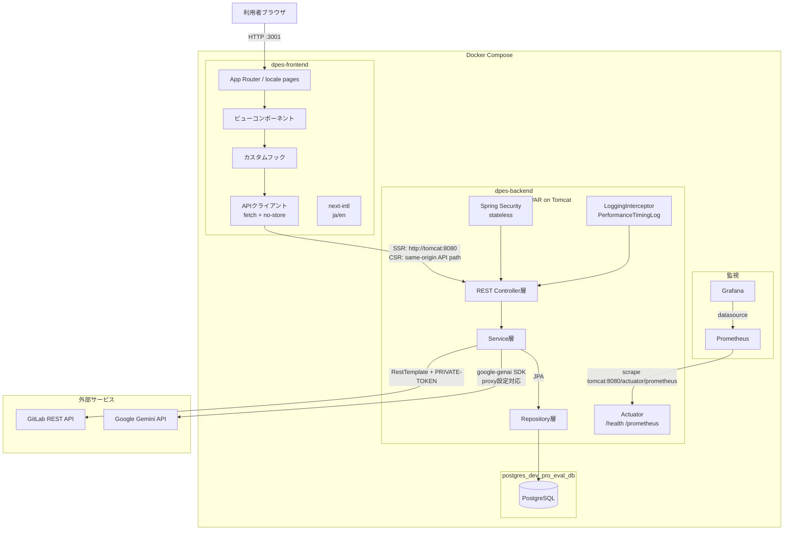
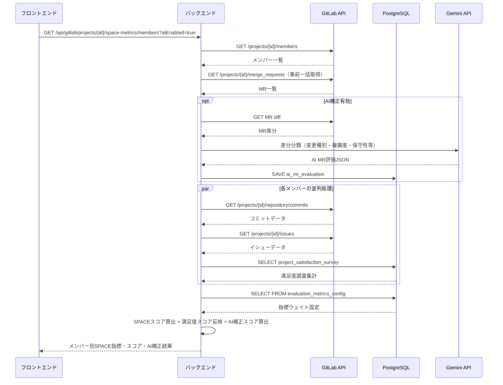

## 0. プロジェクト基本情報

| 項目 | 内容 |
|---|---|
| 期間 | 2026年2月 - 継続中 |
| ステータス | 進行中 / PoC 検証中 |
| 開発タイプ | 0 → 1 の新規開発 |
| 担当範囲 | バックエンド、フロントエンド、CI/CD、PoC 環境構築、部内Feedback収集 |
| 主な成果物 | GitLab API 連携、SPACE 指標計算、可視化画面、Jenkins pipeline、Docker Compose 構成 |

## 0.1 実装状況と改善候補

| Implemented / 実装済み | In Progress / 検証中 | Next Improvements / 改善候補 |
|---|---|---|
| GitLab API からデータを取得する基本処理 | Feedback整理 | Redis追加 |
| SPACE フレームワークに基づく指標カテゴリの整理 | システムパフォーマンス改善 | AI分析結果再利用 |
| メンバー別・プロジェクト別のスコア計算 | 精度改善 | RAG構築 |
| 評価結果の可視化 | Prompt改善 | 認証追加 |
| AI総合評価 | システム評価手段確定 |  |

この表は、公開可能な範囲でプロジェクトの進捗を整理したものである。
実装済みの内容だけでなく、検証中の課題や改善候補も明示することで、プロジェクトを継続的に改善していることを伝えやすくしている。

## 1. プロジェクト概要

### 背景

企業では、IT部門や開発者の生産性をデータやグラフで可視化し、プロジェクトやチームごとの生産性の推移を把握したいというニーズが高まっている。また、AIツール導入などの施策が生産性にどのような影響を与えているかを評価することも求められている。

一方、開発者にとっても、自身の強み・弱みを把握し、他の開発者との比較を通じて、どのような改善を行えば生産性を向上できるかを知ることは重要である。

そこで、本システムでは企業内の開発データおよび開発者の活動データを収集・分析し、SPACEフレームワークに基づく定量評価とAIによる定性評価を組み合わせることで、開発者の生産性を可視化し、改善提案を行う。

### 解決したかった問題

- 会社内のデータ（GitLab、sManager、アンケートなど）を、生産性として定量化・可視化できていない。
- GitLabの活動量だけでは、実際の開発者の生産性を正しく評価できない。
- 開発者は、生産性を向上させるための具体的な改善方法が分からない。
- 管理者は、施策がチームの生産性に与えた効果を評価できない。

### 自分の役割

主に以下を担当した。

- 技術調査・実現性検証
- フロントエンド・バックエンド・データベースの設計・実装
- 新機能の企画・提案
- CI/CD環境の構築・運用
- 開発者フィードバックの収集・改善
- 部長への定期報告・デモ実施

## 2. ゴール

- 開発者の生産性を正確に評価・可視化する。
- AIによる効果的な改善提案を実現する
- 直感的で使いやすいUI/UXを提供する
- 高速な検索・分析を実現する
- 全部門への展開

## 3. システム構成

### 構成図

### データフロー

### 技術スタック

| Layer | Technology | Purpose |
|---|---|---|
| Backend | Spring Boot / Java | GitLab API 連携、指標計算、REST API 提供、Gemini API AI分析|
| Frontend | Next.js / TypeScript | 評価指標の可視化、画面表示 |
| DevOps | Jenkins | CI/CD pipeline の実行 |
| Container | Docker / Docker Compose | 実行環境の標準化、PoC サーバーへのデプロイ |
| Source Control | GitLab | ソース管理、Issue、Merge Request、Commit データ取得 |
| Monitor | Grafana / Prometheus / Micrometer| システムパフォーマンス可視化 |

## 4. SPACE フレームワークとの関係

SPACE は、開発者生産性を単一の数値ではなく、複数の観点から捉えるためのフレームワークである。

| Category | Metrics | 意図 |
|---|---|---|
| Satisfaction | 満足度アンケート | 開発者の満足度を推測する |
| Performance | MR merge 数、Bug数など | パフォーマンスを把握する |
| Activity | Commit 数、MR 数、コメント数など | 開発活動量を確認する |
| Communication | Review コメント、MR discussion | 協業状態を把握する |
| Efficiency | Lead time、Review time | 開発フローの詰まりを見つける |

上記は参考イメージであり、実際の実装では各開発者・各部門に合わせて調整する予定です。

## 5. 実装で難しかった点

### 1. SPACEスコア算出方法

SPACE各指標の算出にどのメトリクスを採用するか、またスコアへ変換する際の各指標の閾値や重み付けの設定が課題となった。
さらに、AIによる分析結果をどのようにスコアへ反映させるかについても検討が必要であった。
これらには明確な正解が存在しないため、パラメータ調整が非常に難しかった。

### 2. バックエンドの処理時間

プロジェクト・開発者・期間を選択後、バックエンドではGitLabから各種データを取得し、SPACE指標の計算、AIによるコード分析・スコア補正、
さらに算出結果を基にしたAI評価・改善提案の生成を順次実行している。これらの処理をすべて同期的に実行しているため、レスポンス時間が非常に長くなるという課題があった。

### 3. システムの評価方法

SPACEスコアおよびAIによる評価・改善提案には客観的な正解が存在しないため、
精度を定量的に測定することが難しく、評価結果を基に継続的に改善するフィードバックサイクルの構築が課題となった。

## 6. 結果

### 成果

- Next.jsを新たに導入し、モダンなフロントエンド開発環境を構築
- Gemini Code Assistantを活用し、実装効率および開発生産性を向上
- 生成AIの活用ノウハウをチーム内で共有し、開発への活用を推進
- SPACEスコアの算出機能および各種データの可視化を実現
- 生成AIを活用し、開発者にとって有用な評価・改善提案を生成（社内検証済み）
- CI/CDパイプラインを構築し、社内ネットワーク環境へのデプロイを実現

### まだ改善できる点

- キャッシュ機能を導入し、Gemini APIの呼び出し回数を削減するとともに、検索・レスポンス速度を向上させる。
- SPACEスコアの算出ロジックおよび計算フローを見直し、精度と保守性を向上させる。
- バックエンドのN+1クエリ問題を解消し、データ取得処理の性能を改善する。

## 7. 行動面・コラボレーション

### コミュニケーション

- 週2回のグループ定例および月1回の部長報告を通じて、開発状況や課題を共有
- グループ内でハンズオンを実施し、システムの利用方法を説明・展開
- アンケートを作成・実施し、利用者からフィードバックを収集
- 管理者・開発者からの要望・改善提案をヒアリングし、システムへ反映・改善を実施

### オーナーシップ

PoC 環境では、機能追加、修正、検証を素早く回すことが重要だった。
そこで、手動デプロイを続けるのではなく、Jenkins と Docker Compose を使った自動デプロイ構成を提案し、実装した。

### 判断したこと

- SPACEスコア算出方式を作った。
- AIの出力を連続値ではなく離散的な評価ランク（High / Middle / Low）とし、システム側でスコアへマッピングする設計とした。
- SPACEスコア算出に用いる各指標を選定するとともに、定量指標を補完するためのAIスコア補正機能を追加した。

## 8. 学び

### 技術面

- Next.jsを用いたフロントエンド開発（多言語対応、State管理、カスタムコンポーネントの実装）
- Gemini APIの活用（レスポンススキーマ定義、構造化出力、プロンプト設計）
- バックエンド監視基盤を構築し、処理性能の可視化・ボトルネック分析を実施

### プロダクト面

- 評価システムでは、指標の透明性と説明可能性が重要である。
- 管理者・開発者双方の視点を考慮し、画面や評価内容を改善した。
- SPACEスコアやAI評価には明確な正解が存在しないため、自分だけでパラメータを調整するのではなく、利用者からのフィードバックを基に継続的に改善する方針とした。

## 9. 説明サマリー

### Short Summary

GitLab の Issue、Merge Request、Commit、Review などの開発データを収集し、SPACE フレームワークに基づいて開発者・チームの生産性を可視化するシステムを開発しました。
私はバックエンド、フロントエンド、データ取得・スコア算出、Gemini API を用いた AI 評価、Docker Compose / Jenkins による PoC 環境構築まで担当しました。
定量指標だけでは判断しにくい部分を AI 分析や利用者フィードバックで補完し、評価結果を改善提案につなげられる仕組みを検証しました。

### Detailed Summary

このプロジェクトは、開発者生産性を単一の活動量ではなく、Satisfaction、Performance、Activity、Communication、Efficiency の複数観点から評価するための PoC システムです。
GitLab API から Issue、Merge Request、Commit、Review などのデータを取得し、SPACE フレームワークに基づいて開発者別・プロジェクト別の指標を計算しました。
さらに、満足度アンケートや Gemini API によるコード分析・AI 評価を組み合わせ、定量データだけでは見えにくい品質や改善余地も補完できる構成にしました。

フロントエンドでは Next.js を導入し、評価指標や AI による改善提案を確認できる画面を実装しました。
バックエンドでは Spring Boot を用いて GitLab 連携、指標計算、AI 評価、データ保存、監視用の Actuator / Prometheus 連携を実装しました。
また、Docker Compose と Jenkins pipeline を整備し、PoC サーバーへ継続的に反映できる環境を構築しました。

実装上は、SPACE スコアに採用するメトリクス、閾値、重み付け、AI 評価結果のスコア反映方法に明確な正解がない点が大きな課題でした。
そのため、AI の出力を High / Middle / Low の評価ランクとして扱い、システム側でスコアへマッピングする設計にしました。
また、処理時間の長さや N+1 クエリ、Gemini API 呼び出し回数などの性能課題に対して、監視基盤を用いてボトルネックを確認し、キャッシュや計算フロー改善を次の改善候補として整理しました。

開発中は、週次・月次の報告、ハンズオン、アンケート、利用者ヒアリングを通じて、管理者と開発者の双方からフィードバックを収集しました。
この経験から、開発者生産性の評価ではスコアそのものよりも、指標の透明性、説明可能性、利用者との継続的な改善サイクルが重要であると学びました。
