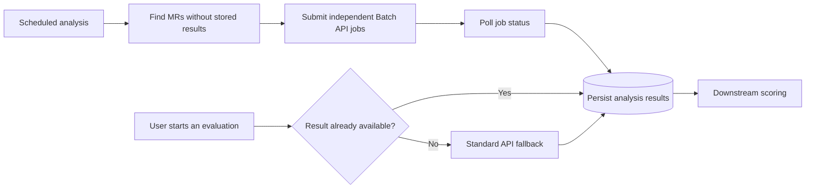

## Project Overview

This project optimized an AI-assisted pipeline that analyzes merge requests (MRs) and supplies structured results to a downstream evaluation process. The original implementation used a synchronous standard model API. It worked for smaller workloads, but a user-selected period could contain many MRs, making both processing cost and response time important design constraints.

The work described here is an anonymized engineering case study. Organization names, internal product names, budgets, source data, workload sizes, and non-public implementation details have intentionally been omitted.

| Item | Public summary |
|---|---|
| Problem | Analyze many MRs without relying on long-running synchronous HTTP requests |
| Primary path | Asynchronous Batch API processing with persisted results |
| Fallback path | Standard API analysis when a required result is not yet available |
| Operating model | Historical backfill followed by weekly incremental analysis |
| Verified result | Moving the workload to the Batch API eliminated the earlier synchronous HTTP timeout in actual tests |
| Still being validated | End-to-end cost reduction, representative project selection, and comparative analysis accuracy |

## Problem

The system needed to analyze every MR in a user-selected time range. The first implementation used a standard synchronous API, which meant the application had to keep an HTTP request open until the model completed its response.

When the requirement expanded to include cost optimization, simply reducing the number of API calls looked attractive. However, combining more work into each synchronous request increased input size and instruction complexity. Model processing became slower, and some requests exceeded the HTTP waiting time available in the surrounding environment.

The engineering problem therefore became broader than cost alone: the design needed to balance cost, reliability, analysis isolation, and the availability of results for downstream processing.

## Constraints

- A selected time range may contain many MRs with substantially different sizes.
- The result for a completed MR is stable enough to compute before a user requests an evaluation.
- Downstream scoring still needs a result when an MR has not yet been pre-analyzed.
- Long model-processing time must not require one synchronous HTTP connection to remain open.
- Public documentation must not expose proprietary code, source data, internal metrics, or operational details.
- Improvements in accuracy and total cost must be measured before they are presented as verified outcomes.

## Approach Evolution

### 1. Multiple MRs in one synchronous request

The first optimization attempt grouped several MRs into a single standard API request to reduce the number of calls.

This introduced a different failure mode. As more MRs were combined, both the token volume and the analysis instructions became more complex. Processing time increased, and the synchronous HTTP call could time out before a response arrived. The issue was not treated as general API instability; it was a mismatch between a long-running workload and a synchronous request-response path.

### 2. Fixed MR count per request

The next approach limited each request to a fixed number of MRs. This was simple to implement, but MR count was not a reliable proxy for request size. A group of small changes and a group of large changes could have very different token volumes, so a fixed count could not consistently control processing time.

### 3. Token-based dynamic grouping

Grouping was then changed to use a token limit rather than a fixed MR count. This better reflected the actual input size and allowed the number of MRs in each request to vary.

The approach still had two important limitations:

- A single oversized MR could exceed the chosen grouping threshold on its own.
- Combining unrelated MRs in one model interaction increased contextual complexity and created a concern about cross-MR influence.

At this stage, independent analysis per MR appeared more suitable for maintaining isolation, but comparative accuracy testing was still required before claiming a measurable improvement.

### 4. Asynchronous Batch API

Further investigation identified an asynchronous Batch API. This changed the design space: work could be submitted without holding a synchronous HTTP connection open, processed in advance, and retrieved later.

The business characteristic that made this approach suitable was result stability. Completed MR content does not normally change, so its analysis can be calculated ahead of the user's evaluation request and reused. Lower published batch-processing unit pricing also supported the cost objective, although unit pricing alone does not prove the reduction in total system cost.

## Architecture Decision

The final design uses the Batch API as the primary path and retains the Standard API as a real-time fallback.

This is an offline-precomputation plus online-compensation pattern. Most work can use the asynchronous, lower-cost path, while the fallback preserves the ability to continue when a newly selected MR has not yet been processed.

## Trade-offs

| Dimension | Decision and rationale | Current evidence |
|---|---|---|
| Cost | Move most analysis to the Batch API and reuse stored results; keep Standard API use limited to gaps | Batch processing has lower published unit pricing; actual end-to-end savings are still being measured |
| Reliability | Remove long model execution from the synchronous HTTP lifecycle | The previous timeout was eliminated in actual Batch API tests |
| Accuracy | Analyze each MR as an independent unit to reduce cross-MR contextual influence | Design rationale only; comparative accuracy validation is ongoing |
| Latency | Accept delayed completion for precomputation while retaining an immediate fallback when downstream work cannot wait | Architecture implemented as primary and fallback paths; operating thresholds are still being refined |

## Final Design

The primary path is responsible for finding MRs without stored results, submitting independent analysis jobs, checking their asynchronous status, and saving completed results. Independent jobs preserve a clear relationship between one MR and one analysis output.

The fallback path runs only when a user requests an evaluation and a required MR result is missing. In that case, the Standard API produces the result in real time so the downstream scoring process can continue. The design does not remove synchronous analysis completely; it places it where real-time availability provides the most value.

## Operation Strategy

The operating strategy has two stages:

1. **Historical backfill:** select representative target projects and pre-analyze a bounded historical period, currently being evaluated in the range of approximately one to two years.
2. **Weekly incremental analysis:** check for newly added MRs, submit those without results, and persist completed analyses for future evaluation requests.

The schedule is deliberately treated as an operating parameter rather than a permanent assumption. Its final frequency should reflect how quickly new results are needed, how often fallback occurs, and the cost of each run.

## Verified Results

The concrete result verified so far is reliability-related: after moving the long-running work to the asynchronous Batch API path, the synchronous HTTP timeout observed in the previous multi-MR flow was eliminated in actual tests.

This result is intentionally narrower than claiming that the entire system is faster or cheaper. Batch processing changes when results become available, so total latency must be evaluated in the context of scheduled precomputation rather than compared only as request-response time.

## Ongoing Validation

The following work remains in progress:

- Measure the actual reduction in total cost, including token volume, retries, polling, storage, and the rate of Standard API fallback.
- Select representative projects and MR distributions so the cost result is not biased toward unusually small or large workloads.
- Compare independent per-MR analysis with grouped multi-MR analysis using a defined evaluation set and review criteria.
- Monitor how often weekly processing leaves a gap that triggers the real-time fallback.
- Refine scheduling and failure-handling rules based on observed workload patterns.

No numerical total-cost reduction or accuracy improvement is presented as a completed result until this validation is finished.

## Lessons Learned

- Optimizing the number of API calls is not the same as optimizing total cost, latency, or reliability.
- Workload size should be measured using the variable that drives the constraint; MR count was less useful than token volume.
- A technically better grouping rule can still leave important edge cases, such as one item exceeding the group limit.
- API interaction style matters as much as model capability. Long-running work that does not require an immediate result is a natural candidate for asynchronous processing.
- Business characteristics should drive architecture. Stable, reusable MR analyses made precomputation practical.
- A primary path and fallback path can optimize different goals without forcing one mechanism to satisfy every case.
- Design hypotheses about cost and accuracy should remain clearly separated from verified production or test evidence.
