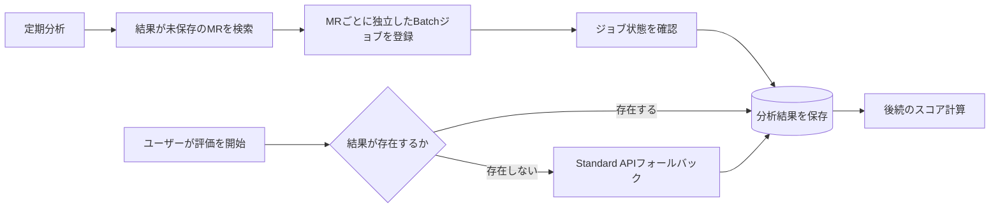

## プロジェクト概要

このプロジェクトでは、マージリクエスト（MR）をAIで分析し、その構造化された結果を後続の評価処理に利用するパイプラインを最適化しました。当初は標準のモデルAPIを同期的に呼び出していました。小規模な入力では動作していましたが、ユーザーが指定した期間に多数のMRが含まれる場合、処理コストと応答時間の両方が重要な設計課題になりました。

本ページは、実際の開発経験を匿名化したエンジニアリング事例です。組織名、社内プロダクト名、予算、ソースデータ、処理規模、非公開の実装詳細は意図的に記載していません。

| 項目 | 公開可能な概要 |
|---|---|
| 課題 | 長時間の同期HTTPリクエストに依存せず、多数のMRを分析すること |
| メイン経路 | Batch APIによる非同期処理と分析結果の保存 |
| フォールバック経路 | 必要な分析結果がまだ存在しない場合のStandard APIによるリアルタイム分析 |
| 運用方式 | 過去データの一括分析と、その後の週次差分分析 |
| 検証済みの結果 | Batch APIへの移行により、従来発生していた同期HTTP timeoutは実テストで解消 |
| 検証中 | システム全体のコスト削減幅、代表プロジェクトの選定、分析精度の比較 |

## 課題

システムは、ユーザーが指定した期間内の各MRを分析する必要があります。最初の実装ではStandard APIを同期的に呼び出していたため、モデルが結果を返すまでアプリケーション側でHTTPリクエストを維持する必要がありました。

コスト削減の要件を受け、当初はAPIの呼び出し回数を減らす方法を検討しました。しかし、一度にまとめる処理を増やすと、入力サイズと指示の複雑さが増加しました。その結果、モデルの処理時間が長くなり、周辺環境で許容されるHTTPの待機時間を超えるケースが発生しました。

そのため、検討すべき課題はコストだけではなく、コスト、信頼性、分析の独立性、後続処理に必要な結果の可用性をどのように両立させるかというシステム設計上の問題になりました。

## 制約

- 選択期間には、サイズが大きく異なる多数のMRが含まれる可能性がある。
- 完了済みMRの分析結果は基本的に変化しないため、ユーザー操作前に計算できる。
- MRがまだ事前分析されていない場合でも、後続のスコア計算には分析結果が必要である。
- 長時間のモデル処理中に、同期HTTP接続を維持し続けない設計が必要である。
- 公開情報には、独自コード、内部データ、社内指標、運用上の非公開情報を含めない。
- 精度と総コストの改善は、測定が完了するまで検証済みの成果として扱わない。

## アプローチの変遷

### 1. 複数MRを一つの同期リクエストで分析

最初のコスト最適化では、APIの呼び出し回数を減らすため、複数のMRを一つのStandard APIリクエストにまとめました。

しかし、MRを増やすほどtoken数と分析指示の複雑さが増え、モデルの処理時間も長くなりました。その結果、レスポンスを受け取る前に同期HTTPリクエストがtimeoutするようになりました。これは単純なAPIの不安定性ではなく、長時間の処理と同期リクエスト・レスポンス方式が適合していないことが原因だと判断しました。

### 2. リクエストごとのMR数を固定

次に、一つのリクエストに含めるMR数の上限を固定しました。実装は単純でしたが、MRごとのサイズには大きな差があります。同じ件数でも、小さな変更のグループと大きな変更のグループではtoken数が大きく異なるため、MR数だけでは処理規模を安定して制御できませんでした。

### 3. token上限による動的グルーピング

そこで、固定件数ではなくtoken上限を基準にし、各MRのサイズに応じて一つのリクエストに含める件数を動的に変更しました。

この方法でも二つの課題が残りました。

- 一つのMRだけで設定したtoken上限を超える場合、通常のグルーピングでは処理できない。
- 関係のない複数MRを一つのモデルコンテキストで分析すると、MR間の影響が発生する可能性がある。

この段階で、MRごとに独立して分析する方式のほうが分析の独立性を維持しやすいと判断しました。ただし、精度が定量的に向上したと主張するには、比較検証が必要です。

### 4. 非同期Batch API

公式ドキュメントを調査する中で、非同期処理を行うBatch APIを見つけました。これにより、同期HTTP接続を維持せずにジョブを登録し、事前に処理した結果を後から取得できるようになります。

この方式が業務特性に合っていた理由は、分析結果の安定性です。完了済みMRの内容は通常変化しないため、ユーザーが評価を開始する前に分析し、結果を再利用できます。また、公開されているBatch APIの単価がStandard APIより低いことも、コスト最適化の方針と一致しました。ただし、単価が低いことだけでは、システム全体の総コスト削減を証明できません。

## アーキテクチャ上の判断

最終設計では、Batch APIをメイン経路とし、Standard APIをリアルタイムフォールバックとして残しました。

これは「オフラインでの事前計算」と「オンラインでの補完」を組み合わせた設計です。大部分の処理は非同期かつ低単価の経路を利用し、新しいMRがまだ処理されていない場合にはStandard APIでリアルタイム性を確保します。

## トレードオフ

| 観点 | 判断と理由 | 現在のエビデンス |
|---|---|---|
| Cost | 大部分をBatch APIで処理し、保存済みの結果を再利用する。Standard APIは未処理分のみに限定する | Batch APIの公開単価は低いが、実際の総コスト削減幅は測定中 |
| Reliability | 長時間のモデル処理を同期HTTPのライフサイクルから分離する | 従来のtimeoutはBatch APIの実テストで解消 |
| Accuracy | 各MRを独立した分析単位として処理し、MR間のコンテキスト影響を抑える | 設計上の判断であり、精度比較は検証中 |
| Latency / Availability | 事前計算の遅延を許容し、結果が必要な時点で未処理ならリアルタイム処理する | メイン経路とフォールバック経路を実装。運用条件は調整中 |

## 最終設計

メイン経路では、分析結果がまだ保存されていないMRを検出し、各MRを独立した分析単位としてBatch APIに登録します。その後、非同期ジョブの状態を確認し、完了した分析結果を保存します。MRと分析結果の対応を一対一に保つことで、分析の独立性も明確になります。

フォールバック経路は、ユーザーが評価を開始した時点で必要なMRの分析結果が存在しない場合にのみ動作します。その場合はStandard APIでリアルタイム分析を行い、結果を取得して後続のスコア計算を継続します。同期分析を完全に廃止するのではなく、リアルタイム性が最も必要な場面に限定して利用する設計です。

## 運用戦略

運用は二つの段階に分けて検討しています。

1. **過去データの一括分析：** 代表性のある対象プロジェクトを選択し、過去約一〜二年のMRを事前分析する。対象期間と代表プロジェクトは現在検証中です。
2. **週次差分分析：** 新しく追加されたMRを確認し、結果が未保存のものをBatch APIで分析して、今後の評価処理に備える。

週次実行は初期案であり、固定された最終仕様ではありません。新しい結果が必要になるまでの時間、フォールバックの発生率、各実行のコストを確認しながら調整する予定です。

## 検証済みの結果

現時点で検証済みの具体的な成果は、信頼性に関するものです。長時間処理を非同期Batch APIへ移したことで、以前の複数MR同期処理で発生していたHTTP timeoutは、実際のテストで解消しました。

一方で、これを「システム全体が高速化した」または「総コストが一定割合下がった」という意味では扱っていません。Batch処理では結果が利用可能になるタイミングが変わるため、レイテンシは単純な同期応答時間ではなく、事前計算を含めた運用全体で評価する必要があります。

## 継続中の検証

現在は以下を検証しています。

- token量、リトライ、状態確認、保存処理、Standard APIへのフォールバック率を含めた実際の総コスト削減幅。
- 小規模または大規模な特殊ケースに偏らない、代表プロジェクトとMR分布の選定。
- MRごとの独立分析と、複数MRをまとめた分析の精度比較。
- 週次処理で未分析期間が発生し、リアルタイムフォールバックが必要になる頻度。
- 実際のワークロードに基づく実行間隔と障害処理ルールの調整。

検証が完了するまでは、総コスト削減率や精度向上率を確定した成果として記載しません。

## 学んだこと

- APIの呼び出し回数を減らすことと、総コスト、レイテンシ、信頼性を最適化することは同じではない。
- 制約を生む実際の変数を測定する必要があり、このケースではMR数よりtoken数のほうが有効だった。
- より合理的なグルーピング方式でも、一つのMRが上限を超えるようなedge caseは残る。
- モデルの能力だけでなく、APIの呼び出し方式も重要である。即時結果が不要な長時間処理は非同期化に適している。
- 技術選定は業務特性から考える必要がある。結果が安定して再利用できるため、MR分析では事前計算が有効だった。
- メイン経路とフォールバック経路に異なる役割を持たせることで、一つの方式にすべての要件を負わせずに済む。
- コストや精度に関する設計仮説と、テストで確認済みの成果は明確に分けて説明する必要がある。
